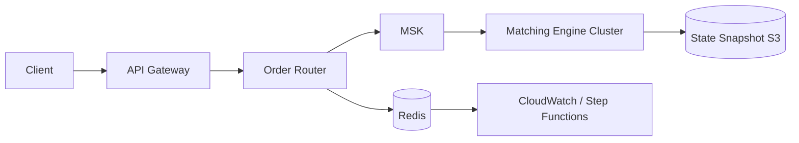
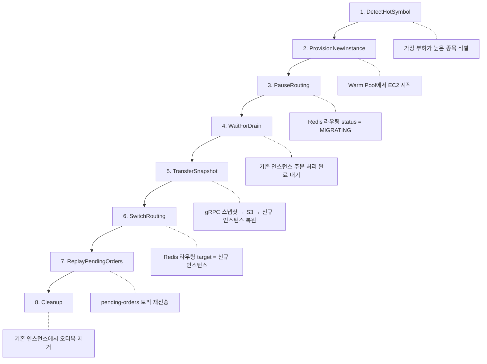
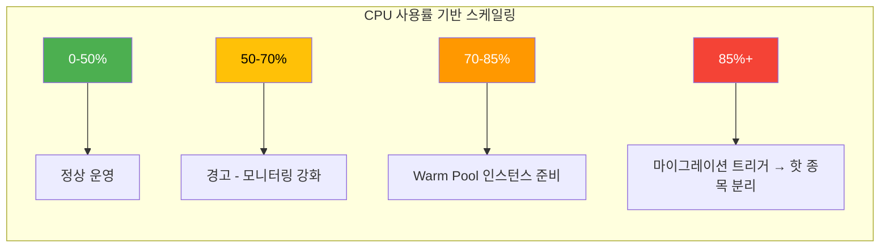
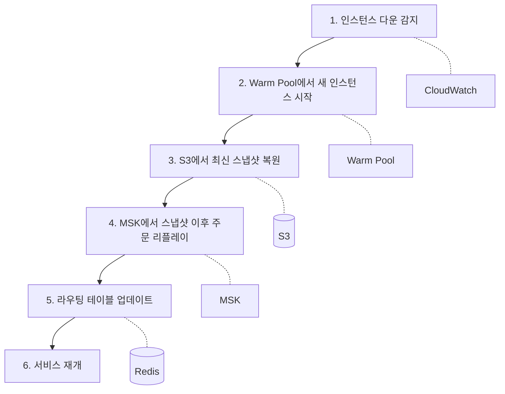
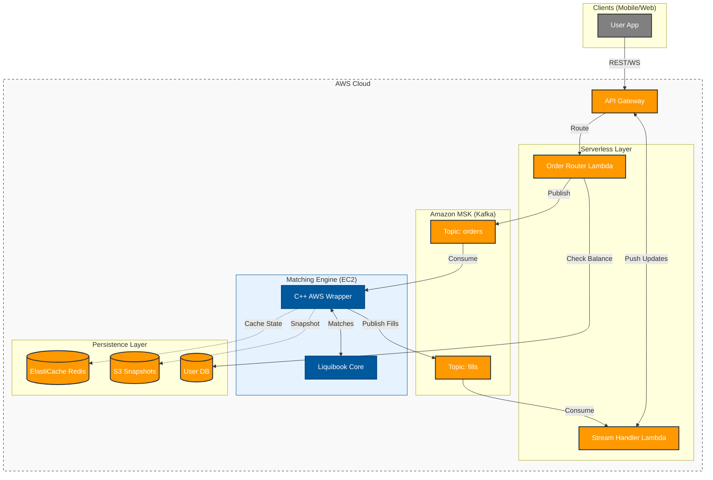
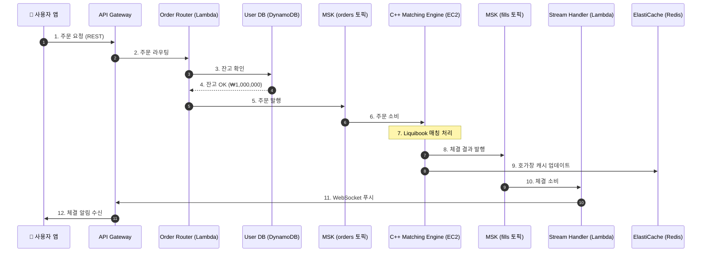
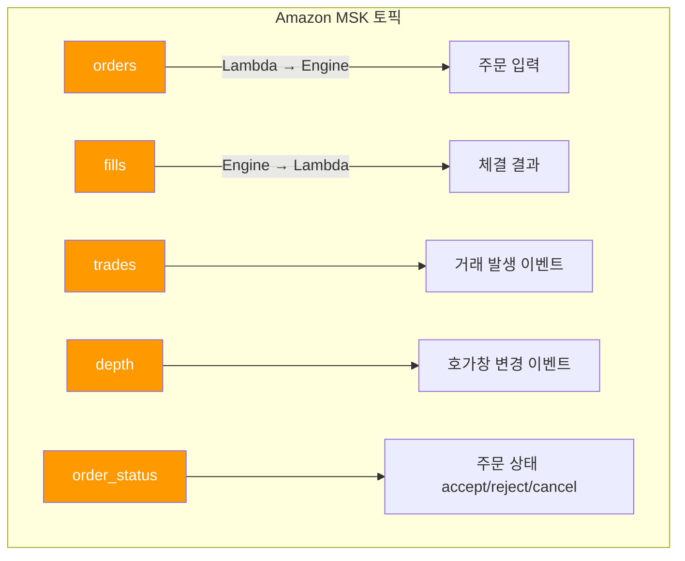
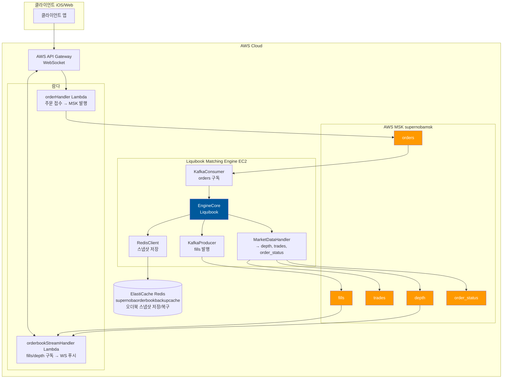

# AWS 핫 샤드 마이그레이션 아키텍처

핫 샤드 마이그레이션을 지원하는 AWS 기반 매칭 엔진 인프라의 기술 스택과 구현 방안입니다.

## 전체 아키텍처 개요



---

## 1. 클라이언트 진입점 (Ingress Layer)

| 컴포넌트                  | AWS 서비스 / 기술 스택                      | 역할                       |
| --------------------- | ------------------------------------ | ------------------------ |
| **WebSocket Gateway** | Amazon API Gateway (WebSocket API)   | 클라이언트 영구 연결 관리, 호가/체결 푸시 |
| **REST API**          | Amazon API Gateway (HTTP API) 또는 ALB | 주문 제출 REST 엔드포인트         |
| **인증**                | Amazon Cognito 또는 자체 JWT             | 사용자 인증 및 토큰 검증           |

### 구현 포인트
- API Gateway는 직접 MSK로 쏘지 못하므로, Lambda 또는 Fargate로 구현된 **Order Router**를 붙입니다.
- WebSocket은 연결 ID를 DynamoDB/Redis에 저장하여 체결 시 푸시 대상을 식별합니다.

---

## 2. 주문 라우터 (Order Router / Traffic Controller)

| 컴포넌트 | 기술 스택 | 역할 |
|---|---|---|
| **라우터 서비스** | Go 또는 Rust on ECS Fargate / EC2 | 종목코드 기반 라우팅 결정, 핫샤드 감지 시 주문 일시정지(Pause) |
| **라우팅 테이블** | Amazon ElastiCache (Redis) | 종목 -> 인스턴스 매핑 정보 저장, 실시간 조회 |
| **주문 큐** | Amazon MSK | 종목별 파티셔닝, 주문 버퍼링 |

### 구현 포인트 (Order Router)
```go
// 의사 코드 (Go)
func RouteOrder(order Order) {
    // 1. Redis에서 종목 라우팅 정보 조회
    routeInfo := redis.Get("route:" + order.Symbol)

    // 2. 해당 종목이 마이그레이션 중(Paused)이면 MSK에만 적재
    if routeInfo.Status == "MIGRATING" {
        msk.Send("pending-orders", order.Symbol, order) // 파티션 키 = 종목
        return
    }

    // 3. 정상이면 해당 파티션(인스턴스)으로 라우팅
    msk.Send("orders", order.Symbol, order)
}
```

- **파티션 키**를 종목 코드로 설정하면, 동일 종목 주문은 항상 같은 파티션으로 가서 순서 보장됩니다.
- Redis 라우팅 테이블 구조:
  - `route:SAMSUNG` -> `{ "target_instance": "i-0abc123", "status": "ACTIVE" | "MIGRATING" }`

---

## 3. 매칭 엔진 클러스터 (Matching Engine Layer)

| 컴포넌트 | 기술 스택 | 역할 |
|---|---|---|
| **매칭 엔진** | Liquibook (C++) + 커스텀 래퍼 on EC2 (c6i.xlarge 이상) | 주문 매칭 핵심 로직 |
| **MSK Consumer** | librdkafka (C++) 또는 Sarama (Go) | MSK에서 주문 소비 |
| **gRPC/TCP Server** | gRPC (C++) 또는 Boost.Asio | 오케스트레이터(Step Functions)와 통신, 스냅샷 요청/응답 |
| **상태 스냅샷 저장소** | Amazon S3 (대용량) 또는 Redis (저지연) | 오더북 직렬화 데이터 저장 |

### Liquibook 추가 구현 필요 사항
1. **MSK Consumer Thread**: MSK에서 주문을 읽어 `OrderBook::add()` 호출.
2. **gRPC Server**:
   - `SnapshotOrderBook(symbol)`: 해당 종목 오더북 직렬화 후 반환.
   - `RestoreOrderBook(symbol, data)`: 직렬화 데이터로 오더북 복원.
   - `RemoveOrderBook(symbol)`: 해당 종목 오더북 메모리 해제.
3. **메트릭 리포터**: 종목별 TPS, CPU 사용률을 CloudWatch Agent 또는 Prometheus로 전송.

---

## 4. 마이그레이션 오케스트레이터 (Orchestrator)

| 컴포넌트 | AWS 서비스 / 기술 스택 | 역할 |
|---|---|---|
| **상태 머신** | AWS Step Functions | 마이그레이션 전체 플로우 제어 |
| **부하 감지** | Amazon CloudWatch Alarms | CPU > 85% 시 Step Functions 트리거 |
| **인스턴스 제어** | AWS Lambda + EC2 API / ASG | 새 인스턴스 프로비저닝, AMI 시작 |



---

## 5. 체결 결과 및 시장 데이터 게시 (Egress Layer)

| 컴포넌트 | 기술 스택 | 역할 |
|---|---|---|
| **체결 이벤트 발행** | Amazon MSK | 체결 발생 시 `fills` 토픽으로 발행 |
| **시장 데이터 처리** | Flink on Kinesis Data Analytics 또는 Lambda Consumer | `fills`, `depth` 토픽 소비 후 가공 |
| **클라이언트 푸시** | API Gateway Management API (WebSocket) | 연결된 클라이언트에 JSON 푸시 |
| **호가 캐싱** | ElastiCache (Redis) | 최신 호가창 저장, 클라이언트 폴링 대응 |

---

## 6. Warm Pool 전략 (비용 최적화)

새 인스턴스 프로비저닝 시간을 줄이기 위해 **EC2 Auto Scaling Warm Pool**을 사용합니다.

- **Warm Pool**: 미리 부팅된(또는 최대 절전모드) EC2 인스턴스를 풀에 대기시킵니다.
- **마이그레이션 시**: Cold Start(수 분) 대신 Warm Start(수 초)로 인스턴스 확보.
- **비용**: Running 상태가 아닌 Stopped 상태로 두면 EBS 비용만 발생.

---

## 요약 기술 스택 테이블

| 레이어 | 주요 기술 |
|---|---|
| 클라이언트 진입 | API Gateway (HTTP/WebSocket), Cognito |
| 라우팅 | Go/Rust on Fargate, ElastiCache Redis |
| 메시지 큐 | Amazon MSK (Kafka) |
| 매칭 엔진 | Liquibook C++ + gRPC + MSK Client (librdkafka) on EC2 |
| 오케스트레이션 | Step Functions, Lambda, CloudWatch Alarms |
| 스냅샷 저장 | S3 (또는 Redis for low latency) |
| 시장 데이터 | MSK, Lambda, API Gateway Push |

---

## 7. 용량 산정 (Capacity Planning)

### 7.1 Liquibook 성능 벤치마크 (로컬 테스트 기준)

| 테스트 유형 | 결과 |
|---|---|
| Depth OrderBook TPS | 273,652 주문/초 |
| BBO OrderBook TPS | 260,291 주문/초 |
| No Depth TPS | 297,762 주문/초 |
| 평균 레이턴시 | ~3,000 나노초 (3μs) |

### 7.2 사용자 행동 기반 TPS 추정

| 사용자 유형 | 주문 빈도 | 초당 주문 수 |
|---|---|---|
| 일반 사용자 | 10초에 1회 | 0.1 TPS |
| 활발한 트레이더 | 3초에 1회 | 0.33 TPS |
| 데이 트레이더 | 1초에 1회 | 1 TPS |
| **평균 (혼합)** | 5초에 1회 | **0.2 TPS** |

### 7.3 동시 사용자 수 계산

```
동시 사용자 = 엔진 TPS ÷ 사용자당 TPS
```

**예시 (평균 사용자 0.2 TPS 기준):**

| 환경 | TPS | 동시 사용자 |
|---|---|---|
| 로컬 (273K TPS) | 273,000 | 1,365,000명 |
| t2.micro (~10% 성능) | ~10,000 | ~50,000명 |
| t2.medium | ~40,000 | ~200,000명 |
| c6i.large | ~80,000 | ~400,000명 |

---

## 8. EC2 인스턴스 사이징

### 8.1 인스턴스별 예상 성능

| 인스턴스 | vCPU | RAM | 예상 TPS | 권장 동시 사용자 | 권장 종목 수 |
|---|---|---|---|---|---|
| **t2.micro** | 1 | 1GB | ~10,000 | 5만 명 | 5~10개 |
| **t2.small** | 1 | 2GB | ~15,000 | 7.5만 명 | 10~15개 |
| **t2.medium** | 2 | 4GB | ~40,000 | 20만 명 | 50~100개 |
| **c6i.large** | 2 | 4GB | ~80,000 | 40만 명 | 100~150개 |
| **c6i.xlarge** | 4 | 8GB | ~200,000 | 100만 명 | 300~500개 |

> ⚠️ **주의**: t2 인스턴스는 CPU 크레딧 제한이 있어 지속적인 부하에는 부적합합니다.

### 8.2 시나리오별 권장 구성

#### MVP (동시 사용자 1만 명, 종목 20개)

```
1x t2.medium
- 월 비용: ~$42
- 예상 TPS: 40,000
- 필요 TPS: 1만 × 0.2 = 2,000
- 여유율: 20배
```

#### 성장기 (동시 사용자 5만 명, 종목 100개)

```
1x c6i.large
- 월 비용: ~$69
- 예상 TPS: 80,000
- 필요 TPS: 5만 × 0.2 = 10,000
- 여유율: 8배
```

#### 대규모 (동시 사용자 50만 명, 종목 500개)

```
3x c6i.xlarge (샤딩)
- 월 비용: ~$414
- 예상 TPS: 600,000 (총합)
- 필요 TPS: 50만 × 0.2 = 100,000
- 여유율: 6배
```

---

## 9. 비용 추정 (서울 리전)

### 9.1 EC2 비용

| 인스턴스 | 시간당 | 월 비용 (24/7) | 용도 |
|---|---|---|---|
| t2.micro | $0.0144 | **$10** | 개발/테스트 |
| t2.medium | $0.058 | **$42** | MVP |
| c6i.large | $0.096 | **$69** | 프로덕션 |
| c6i.xlarge | $0.192 | **$138** | 핫 샤드 |

### 9.2 관련 서비스 비용 (월 예상)

| 서비스 | 사양 | 월 비용 |
|---|---|---|
| **Amazon MSK** | kafka.t3.small × 2 | ~$100 |
| **ElastiCache Redis** | cache.t3.micro | ~$15 |
| **API Gateway** | 100만 요청 | ~$3.50 |
| **S3** | 10GB 스냅샷 | ~$0.25 |
| **CloudWatch** | 기본 메트릭 | ~$10 |

### 9.3 총 비용 예상

| 규모 | 월 예상 비용 |
|---|---|
| **개발/테스트** | ~$50 |
| **MVP** | ~$200 |
| **성장기** | ~$400 |
| **대규모** | ~$1,000+ |

---

## 10. 핫 샤드 마이그레이션 트리거 기준



---

## 11. 래퍼 코드 구현 체크리스트

Liquibook 핵심 엔진을 AWS 프로덕션에 배포하려면 다음 래퍼 코드가 필요합니다:

### 11.1 필수 구현 (🔴)

| 컴포넌트 | 역할 | 기술 스택 |
|---|---|---|
| **MSK Consumer** | MSK → Liquibook 연결 | C++: librdkafka / Go: sarama |
| **TradeListener** | 체결 → MSK 발행 | Liquibook 콜백 구현 |
| **잔고 확인** | 주문 전 잔고 검증 | Order Router에서 처리 |
| **가격 검증** | 호가 제한 (상한가/하한가) | Order Router에서 처리 |

### 11.2 중요 구현 (🟡)

| 컴포넌트 | 역할 | 기술 스택 |
|---|---|---|
| **gRPC Server** | 스냅샷/복원, 오케스트레이션 통신 | C++: grpc / Go: grpc-go |
| **오더북 직렬화** | 스냅샷 → S3/Redis | JSON/Protobuf |
| **메트릭 리포터** | TPS/CPU → CloudWatch | AWS SDK |

### 11.3 권장 구현 (🟢)

| 컴포넌트 | 역할 |
|---|---|
| **로그 수집** | 주문/체결 로그 → CloudWatch Logs |
| **장애 복구** | 인스턴스 다운 시 자동 복구 |
| **중복 주문 방지** | 동일 주문 ID 거부 |

---

## 12. 영속성 (Persistence) 전략

Liquibook은 인메모리 엔진이므로, 데이터 영속성을 별도로 구현해야 합니다:

| 데이터 | 저장소 | 방법 |
|---|---|---|
| **오더북 스냅샷** | S3 | 주기적 직렬화 (1분 간격) |
| **체결 기록** | DynamoDB / RDS | TradeListener에서 기록 |
| **주문 로그** | Amazon MSK (보존) | 주문 토픽 retention 설정 |
| **사용자 잔고** | DynamoDB | 체결 시 업데이트 |

### 장애 복구 시나리오



---

## 13. 전체 아키텍처 상세 다이어그램



## 14. 고화질 아키텍처 다이어그램 생성 (Official Icons)

AWS 공식 아이콘을 사용한 고화질 다이어그램(PNG)을 생성하려면 다음 단계를 따르세요.

1.  **Graphviz 설치**: [Graphviz 다운로드](https://graphviz.org/download/) 및 설치 (시스템 PATH에 추가 필수).
2.  **Python 라이브러리 설치**:
    ```bash
    pip install diagrams
    ```
3.  **스크립트 실행**:
    ```bash
    python generate_architecture.py
    ```
4.  결과물 `liquibook_aws_architecture.png` 확인.

---

## 15. 전체 데이터 흐름도 (End-to-End Data Flow)

아래는 사용자가 주문을 넣고 체결 결과를 받기까지의 **전체 데이터 흐름**입니다.



### 15.1 단계별 데이터 예시

#### 1️⃣ 사용자 → API Gateway: 주문 요청

```json
// POST /orders
{
  "user_id": "user_12345",
  "symbol": "TSLA",
  "side": "BUY",
  "order_type": "LIMIT",
  "price": 250.50,
  "quantity": 10
}
```

#### 2️⃣ Order Router → User DB: 잔고 확인

```json
// DynamoDB Query: Key = { "user_id": "user_12345" }
// Response:
{
  "user_id": "user_12345",
  "balance": 1000000,
  "positions": { "TSLA": { "qty": 5, "avg_price": 245.00 } }
}
```

**검증**: `250.50 × 10 = ₩2,505` ≤ `₩1,000,000` ✅

#### 3️⃣ Order Router → MSK (orders 토픽): 주문 발행

```json
// Topic: orders, Partition Key: "TSLA"
{
  "order_id": "ord_abc123",
  "user_id": "user_12345",
  "symbol": "TSLA",
  "side": "BUY",
  "order_type": "LIMIT",
  "price": 250.50,
  "quantity": 10,
  "timestamp": "2025-12-06T11:50:00.123Z"
}
```

#### 4️⃣ C++ Engine: Liquibook 매칭 처리

**매칭 전 오더북 상태 (TSLA)**:
```
        ASK (매도)             |         BID (매수)
   수량    가격                |    가격      수량
   ─────────────────────────────────────────────────
    15    251.00              |    249.50     20
     8    250.50  ← 매칭 대상  |    249.00     30
    25    250.00              |    248.50     15
```

**매칭 결과**: 매수 `10주 @ 250.50` vs 매도 `8주 @ 250.50` → **8주 체결**, 잔량 **2주** 오더북 등록

#### 5️⃣ C++ Engine → MSK (fills 토픽): 체결 결과 발행

```json
// Topic: fills
{
  "trade_id": "trd_xyz789",
  "symbol": "TSLA",
  "price": 250.50,
  "quantity": 8,
  "buyer": { "order_id": "ord_abc123", "user_id": "user_12345" },
  "seller": { "order_id": "ord_def456", "user_id": "user_67890" },
  "timestamp": "2025-12-06T11:50:00.456Z"
}
```

#### 6️⃣ C++ Engine → Redis: 호가창 캐시 업데이트

```json
// Redis Key: orderbook:TSLA
{
  "symbol": "TSLA",
  "asks": [
    { "price": 250.00, "qty": 25 },
    { "price": 251.00, "qty": 15 }
  ],
  "bids": [
    { "price": 250.50, "qty": 2 },
    { "price": 249.50, "qty": 20 },
    { "price": 249.00, "qty": 30 }
  ],
  "last_price": 250.50,
  "last_qty": 8
}
```

#### 7️⃣ Stream Handler → 사용자 앱: WebSocket 푸시

```json
// WebSocket to user_12345
{
  "type": "FILL",
  "data": {
    "order_id": "ord_abc123",
    "symbol": "TSLA",
    "side": "BUY",
    "filled_qty": 8,
    "filled_price": 250.50,
    "remaining_qty": 2,
    "status": "PARTIALLY_FILLED"
  }
}
```

### 15.2 데이터 타입별 저장소 요약

| 데이터 | 저장소 | 목적 |
|---|---|---|
| **주문 메시지** | MSK (orders) | 비동기 주문 큐 |
| **체결 메시지** | MSK (fills) | 비동기 체결 알림 |
| **사용자 잔고** | DynamoDB | 영구 저장 |
| **실시간 호가창** | Redis | 저지연 캐시 |
| **오더북 스냅샷** | S3 | 장애 복구용 백업 |

---

## 16. 현재 구현 상태 (Current Implementation)

### 16.1 배포된 AWS 리소스

| 서비스 | 리소스 이름 | 상태 |
|---|---|---|
| **Amazon MSK** | `supernobamsk` | ✅ 운영 중 |
| **ElastiCache Redis** | `supernobaorderbookbackupcache` | ✅ 운영 중 |
| **EC2 (매칭 엔진)** | `ip-172-31-47-97` | ✅ 빌드 완료 |

### 16.2 MSK 브로커 엔드포인트

```
# IAM 인증 (포트 9098)
b-1.supernobamsk.c1dtdv.c3.kafka.ap-northeast-2.amazonaws.com:9098
b-2.supernobamsk.c1dtdv.c3.kafka.ap-northeast-2.amazonaws.com:9098
b-3.supernobamsk.c1dtdv.c3.kafka.ap-northeast-2.amazonaws.com:9098
```

### 16.3 ElastiCache Redis 엔드포인트

```
master.supernobaorderbookbackupcache.5vrxzz.apn2.cache.amazonaws.com:6379
```

### 16.4 C++ 매칭 엔진 구현 현황

| 컴포넌트 | 파일 | 상태 |
|---|---|---|
| **KafkaConsumer** | `kafka_consumer.cpp` | ✅ 완료 (IAM 인증 포함) |
| **KafkaProducer** | `kafka_producer.cpp` | ✅ 완료 (IAM 인증 포함) |
| **EngineCore** | `engine_core.cpp` | ✅ 완료 |
| **MarketDataHandler** | `market_data_handler.cpp` | ✅ 완료 |
| **RedisClient** | `redis_client.cpp` | ✅ 완료 |
| **gRPC Service** | `grpc_service.cpp` | ✅ 완료 |
| **MSK IAM Auth** | `msk_iam_auth.cpp` | ✅ 완료 |
| **Metrics** | `metrics.cpp` | ✅ 완료 |

### 16.5 Kafka 토픽 구조



### 16.6 EC2 실행 방법

```bash
# 1. EC2 접속 후 실행 스크립트 사용
cd ~/liquibook/wrapper
./run_engine.sh

# 스크립트가 자동으로:
# - 환경변수 설정
# - git pull
# - cmake 빌드
# - 매칭 엔진 실행
```

### 16.7 환경변수 설정

| 변수 | 값 | 설명 |
|---|---|---|
| `KAFKA_BROKERS` | MSK IAM 엔드포인트 (9098) | Kafka 브로커 주소 |
| `REDIS_HOST` | ElastiCache 엔드포인트 | Redis 호스트 |
| `REDIS_PORT` | `6379` | Redis 포트 |
| `AWS_REGION` | `ap-northeast-2` | AWS 리전 |
| `GRPC_PORT` | `50051` | gRPC 서버 포트 |
| `LOG_LEVEL` | `DEBUG` / `INFO` | 로그 레벨 |

---

## 17. 현재 시스템 아키텍처



---

## 18. 구현 완료된 기능 (2025-12-07)

### 18.1 핵심 기능

| 기능 | 상태 | 설명 |
|------|------|------|
| **주문 수신** | ✅ | MSK orders 토픽에서 주문 소비 |
| **매칭 처리** | ✅ | Liquibook 가격-시간 우선순위 알고리즘 |
| **체결 발행** | ✅ | fills, trades, depth, order_status 토픽 발행 |
| **자동 스냅샷** | ✅ | 10초마다 모든 오더북 → Redis 저장 |
| **시작 시 복원** | ✅ | Redis에서 스냅샷 로드 → 오더북 복원 |
| **종료 시 저장** | ✅ | Ctrl+C 시 최종 스냅샷 저장 후 종료 |

### 18.2 주문 JSON 포맷

```json
{
  "action": "ADD",
  "symbol": "AAPL",
  "order_id": "order-001",
  "user_id": "user123",
  "is_buy": true,
  "price": 15000,
  "quantity": 100
}
```

| 필드 | 타입 | 설명 |
|------|------|------|
| `action` | string | `ADD`, `CANCEL`, `REPLACE` |
| `symbol` | string | 종목 코드 |
| `order_id` | string | 주문 고유 ID |
| `user_id` | string | 사용자 ID |
| `is_buy` | boolean | 매수=true, 매도=false |
| `price` | integer | 주문 가격 (센트 단위) |
| `quantity` | integer | 주문 수량 |

### 18.3 현재 MSK 접근 방식

```
# Plaintext (포트 9092) - 현재 사용 중
b-1.supernobamsk.c1dtdv.c3.kafka.ap-northeast-2.amazonaws.com:9092
b-2.supernobamsk.c1dtdv.c3.kafka.ap-northeast-2.amazonaws.com:9092
b-3.supernobamsk.c1dtdv.c3.kafka.ap-northeast-2.amazonaws.com:9092
```

> ⚠️ IAM 인증(9098)은 librdkafka C++ 호환 이슈로 Plaintext 사용 중

---

## 19. c5.2xlarge 용량 분석

### 19.1 Liquibook 벤치마크 (PERFORMANCE.md 기준)

| 테스트 유형 | TPS (2.4 GHz i7) |
|-------------|------------------|
| **5 Level Depth** | 2,062,158 |
| **BBO Only** | 2,139,950 |
| **Order Book Only** | 2,494,532 |

### 19.2 c5.2xlarge 사양

| 항목 | 값 |
|------|-----|
| **vCPU** | 8 |
| **RAM** | 16 GB |
| **네트워크** | 최대 10 Gbps |
| **클럭** | 3.0 GHz (Turbo 3.5 GHz) |

### 19.3 예상 TPS 계산

```
벤치마크 기준: 2,062,158 TPS (2.4 GHz 단일 코어)
c5.2xlarge 클럭: 3.0 GHz → 약 25% 성능 향상

단일 코어 예상: 2,062,158 × 1.25 = ~2,577,000 TPS

AWS/네트워크 오버헤드 고려 (50% 감소): ~1,300,000 TPS
```

### 19.4 동시 사용자 및 종목 수 계산

| 사용자 유형 | 주문 빈도 | 초당 주문 |
|-------------|-----------|-----------|
| 일반 사용자 | 10초에 1회 | 0.1 TPS |
| 활발한 트레이더 | 3초에 1회 | 0.33 TPS |
| **평균** | 5초에 1회 | **0.2 TPS** |

```
c5.2xlarge 예상 TPS: 1,300,000
사용자당 평균 TPS: 0.2

최대 동시 사용자 = 1,300,000 ÷ 0.2 = 6,500,000명
```

### 19.5 권장 종목 수

| 시나리오 | 동시 사용자 | 종목당 사용자 | 권장 종목 |
|----------|-------------|---------------|-----------|
| **보수적** | 100,000 | 1,000 | **100개** |
| **일반** | 500,000 | 500 | **1,000개** |
| **최대** | 1,000,000 | 200 | **5,000개** |

> ⚠️ 실제 운영 시 Kafka/Redis 오버헤드, 메모리 사용량 등 고려 필요

### 19.6 결론

**c5.2xlarge 1대로 충분히 5,000+ 종목 처리 가능**

- MVP (100개 종목): 여유 10배+
- 성장기 (1,000개 종목): 여유 5배+
- 대규모 (5,000개 종목): 여유 2배+

---

*최종 업데이트: 2025-12-07*

