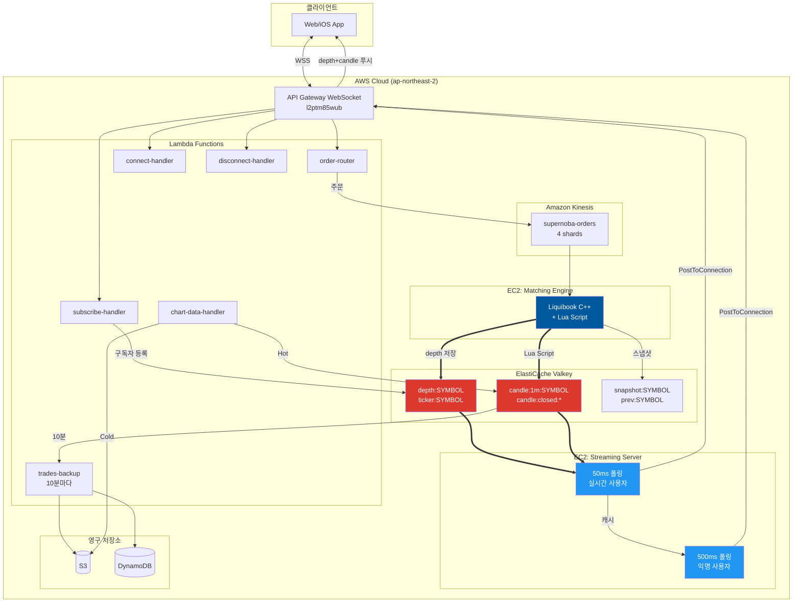
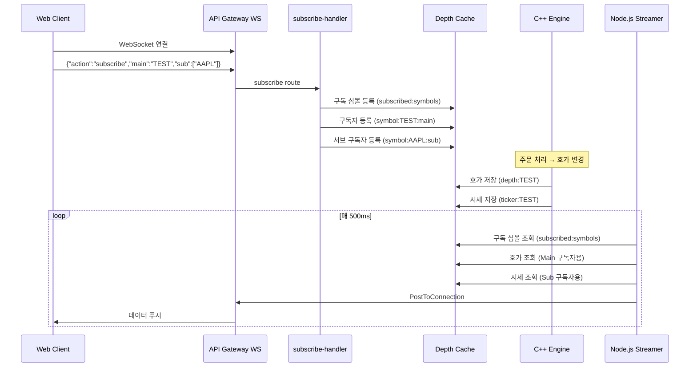

# AWS Supernoba 아키텍처

Amazon Kinesis + Valkey 기반 실시간 매칭 엔진 인프라 (2025-12-13 최신)

> **핵심 원칙**: Kinesis는 주문/체결용만 사용. Depth 데이터는 Valkey에 직접 저장 → Streamer가 폴링하여 WebSocket 푸시.

---

## 현재 운영 아키텍처



---

## 실시간 스트리밍 흐름



---

## 차트 데이터 아키텍처

> **Valkey 중심 설계**: C++ Engine에서 Lua Script로 캔들 집계, Lambda는 백그라운드 백업만 담당


### 캔들 처리 흐름

| 단계 | 컴포넌트 | 지연시간 |
|------|----------|----------|
| 체결 → 캔들 집계 | C++ Engine (Lua Script) | ~1ms |
| 캔들 → 클라이언트 | Streamer (50ms/500ms) | 50~500ms |
| 캔들 → 영구 저장 | Lambda (10분마다) | ~분 단위 |

### 타임프레임별 전략

| 타임프레임 | 집계 위치 | 저장 |
|------------|----------|------|
| **1분** | Valkey (Lua Script) | Hot: Valkey, Cold: S3 |
| 3분, 5분, 15분, 30분 | Streamer 롤업 | Valkey |
| **1시간, 4시간, 1일** | Lambda 롤업 | DynamoDB + S3 |

---

## Kinesis 스트림 구성

| 스트림 | Shards | 용도 | 방향 |
|--------|--------|------|------|
| `supernoba-orders` | 4 | 주문 입력 | Lambda → Engine |
| `supernoba-fills` | 2 | 체결 알림 | Engine → Lambda (알림용) |
| `supernoba-order-status` | 2 | 주문 상태 변경 | Engine → Lambda |

> ⚠️ `supernoba-depth` 스트림은 **사용하지 않음**. Depth는 Valkey 직접 저장.

---

## ElastiCache 구성 (Dual Valkey)

| 캐시 | 엔드포인트 | 용도 | TLS |
|------|-----------|------|-----|
| **Backup Cache** | `master.supernobaorderbookbackupcache.5vrxzz.apn2.cache.amazonaws.com:6379` | 오더북 스냅샷, 전일 데이터 | ❌ |
| **Depth Cache** | `supernoba-depth-cache.5vrxzz.ng.0001.apn2.cache.amazonaws.com:6379` | 실시간 호가, 구독자 관리 | ❌ |

---

## Redis 키 구조

### Depth Cache (실시간 데이터)

| 키 패턴 | 타입 | 용도 | 생성 위치 |
|---------|------|------|----------|
| `depth:SYMBOL` | String | 실시간 호가 10단계 (Main) | C++ `market_data_handler.cpp` |
| `ticker:SYMBOL` | String | 간략 시세 (Sub) | C++ `updateTickerCache()` |
| `active:symbols` | Set | 거래 가능 종목 목록 (Admin 관리) | `symbol-manager` |
| `subscribed:symbols` | Set | 현재 구독자 있는 심볼 (자동) | `subscribe-handler`, `disconnect-handler` |
| `symbol:SYMBOL:main` | Set | Main 구독자 connectionId | `subscribe-handler` |
| `symbol:SYMBOL:sub` | Set | Sub 구독자 connectionId | `subscribe-handler` |
| `symbol:SYMBOL:subscribers` | Set | 레거시 구독자 (호환용) | `subscribe-handler` |
| `conn:CONNID:main` | String | 연결별 Main 구독 심볼 | `subscribe-handler` |
| `ws:CONNID` | String | WebSocket 연결 정보 | `connect-handler` |
| `user:USERID:connections` | Set | 사용자별 연결 목록 | `connect-handler` |
| `candle:1m:SYMBOL` | Hash | 활성 1분봉 (o,h,l,c,v,t) | C++ Lua Script |
| `candle:5m:SYMBOL` | Hash | 활성 5분봉 | Streamer 롤업 |
| `candle:closed:1m:SYMBOL` | List | 마감 1분봉 버퍼 (백업 전) | C++ Lua Script |
| `trades:SYMBOL` | List | 체결 버퍼 (TTL 24h) | C++ Engine |

### Backup Cache (영구 데이터)

| 키 패턴 | 타입 | 용도 | 생성 위치 |
|---------|------|------|----------|
| `snapshot:SYMBOL` | String | 오더북 스냅샷 | C++ `redis_client.cpp` |
| `prev:SYMBOL` | String | 전일 OHLC | C++ `savePrevDayData()` |

---

## 데이터 포맷

### Depth (호가창)

```json
{"e":"d","s":"TEST","t":1733896438267,"b":[[150,30],[149,20]],"a":[[151,30],[152,25]]}
```

| 필드 | 설명 |
|------|------|
| `e` | 이벤트 타입 ("d" = depth) |
| `s` | 심볼 |
| `t` | 타임스탬프 (epoch ms) |
| `b` | Bids `[[price, qty], ...]` (최대 10개) |
| `a` | Asks `[[price, qty], ...]` (최대 10개) |

### Ticker (전광판)

```json
{"e":"t","s":"TEST","t":1733896438267,"p":150,"c":2.5,"yc":-1.2}
```

| 필드 | 설명 |
|------|------|
| `e` | 이벤트 타입 ("t" = ticker) |
| `p` | 현재가 |
| `c` | 금일 등락률 (%) |
| `yc` | 전일 등락률 (%) |

---

## Lambda 함수

| 함수명 | 트리거 | 역할 |
|--------|--------|------|
| `Supernoba-order-router` | API Gateway REST | 주문 검증 → Kinesis (`active:symbols` 확인) |
| `symbol-manager` | API Gateway REST | 종목 관리 (조회/추가/삭제) |
| `connect-handler` | `$connect` | 연결 정보 저장, `ws:*` 키 생성 |
| `subscribe-handler` | `subscribe` | Main/Sub 구독 등록, `subscribed:symbols` 추가 |
| `disconnect-handler` | `$disconnect` | 구독 정리, `subscribed:symbols` 제거 |
| `trades-backup-handler` | EventBridge (10분) | 체결 → S3 + DynamoDB |
| `chart-data-handler` | API Gateway HTTP | 1분봉 → 상위 타임프레임 집계 |
| `candle-aggregator` | EventBridge (매 분) | trades → 1분봉 → DynamoDB |

---

## EC2 인스턴스

| 역할 | Private IP | 타입 | 상태 |
|------|------------|------|------|
| **Matching Engine** | 172.31.47.97 | t2.medium | ✅ 운영 중 |
| **Streaming Server** | 172.31.57.219 | t2.micro | ✅ 운영 중 |

---

## 실행 스크립트

### 매칭 엔진 (C++)

```bash
cd ~/liquibook/wrapper
./run_engine.sh           # 기본 (INFO)
./run_engine.sh --debug   # 디버그 (DEBUG)
./run_engine.sh --dev     # 캐시 초기화 후 시작
```

### 스트리밍 서버 (Node.js)

```bash
cd ~/liquibook/streamer/node
./run_streamer.sh           # 기본
./run_streamer.sh --debug   # 디버그
./run_streamer.sh --init    # 익명 사용자 캐시 초기화
```

---

## C++ 매칭 엔진 구현 현황

| 컴포넌트 | 파일 | 설명 |
|----------|------|------|
| **KinesisConsumer** | `kinesis_consumer.cpp` | Kinesis → 주문 수신 |
| **KinesisProducer** | `kinesis_producer.cpp` | 체결 → Kinesis 발행 |
| **DynamoDBClient** | `dynamodb_client.cpp` | 체결 → DynamoDB 저장 |
| **EngineCore** | `engine_core.cpp` | Liquibook 래퍼 |
| **MarketDataHandler** | `market_data_handler.cpp` | 체결/Depth 이벤트 처리 |
| **RedisClient** | `redis_client.cpp` | Valkey 연결 |
| **gRPC Service** | `grpc_service.cpp` | 스냅샷 API |
| **Metrics** | `metrics.cpp` | 통계 수집 |

---

## 환경변수

### 매칭 엔진

| 변수 | 기본값 | 설명 |
|------|--------|------|
| `KINESIS_ORDERS_STREAM` | `supernoba-orders` | 주문 스트림 |
| `KINESIS_FILLS_STREAM` | `supernoba-fills` | 체결 스트림 |
| `DYNAMODB_TABLE` | `trade_history` | 체결 기록 테이블 |
| `REDIS_HOST` | (Backup Cache) | 스냅샷 캐시 |
| `DEPTH_CACHE_HOST` | (Depth Cache) | 호가 캐시 |
| `AWS_REGION` | `ap-northeast-2` | AWS 리전 |
| `GRPC_PORT` | `50051` | gRPC 서버 포트 |
| `LOG_LEVEL` | `INFO` | 로그 레벨 |

### 스트리밍 서버

| 변수 | 기본값 | 설명 |
|------|--------|------|
| `VALKEY_HOST` | (Depth Cache) | Valkey 호스트 |
| `VALKEY_PORT` | `6379` | Valkey 포트 |
| `WEBSOCKET_ENDPOINT` | `l2ptm85wub...` | API Gateway 엔드포인트 |
| `DEBUG_MODE` | `false` | 디버그 모드 |

---

## 주문 JSON 포맷

```json
{
  "action": "ADD",
  "symbol": "TEST",
  "order_id": "ord_abc123",
  "user_id": "user_12345",
  "is_buy": true,
  "price": 15000,
  "quantity": 100
}
```

| 필드 | 타입 | 설명 |
|------|------|------|
| `action` | string | `ADD`, `CANCEL`, `REPLACE` |
| `symbol` | string | 종목 코드 |
| `order_id` | string | 주문 고유 ID |
| `user_id` | string | 사용자 ID |
| `is_buy` | boolean | 매수=true, 매도=false |
| `price` | integer | 주문 가격 |
| `quantity` | integer | 주문 수량 |

---

## 용량 산정

### Liquibook 성능 벤치마크

| 테스트 유형 | 결과 |
|------------|------|
| Depth OrderBook TPS | 273,652 주문/초 |
| 평균 레이턴시 | ~3,000 나노초 (3μs) |

### 인스턴스별 예상 성능

| 인스턴스 | vCPU | RAM | 예상 TPS | 권장 동시 사용자 |
|----------|------|-----|----------|------------------|
| t2.medium | 2 | 4GB | ~40,000 | 20만 명 |
| c6i.large | 2 | 4GB | ~80,000 | 40만 명 |
| c6i.xlarge | 4 | 8GB | ~200,000 | 100만 명 |

---

## TODO

| 기능 | 위치 | 설명 |
|------|------|------|
| **사용자 알림** | `user-notify-handler` Lambda | fills 개인 푸시 |
| **잔고 확인** | `order-router` Lambda | 주문 전 Supabase 잔고 검증 |
| **S3 백업** | C++ Engine | 장기 백업용 S3 저장 (현재 Redis만) |

---

*최종 업데이트: 2025-12-13*
