# AWS Supernoba 아키텍처

Amazon Kinesis + Valkey 기반 실시간 매칭 엔진 인프라 (2025-12-16 최신)

> **핵심 원칙**: Kinesis는 주문/체결용만 사용. Depth 데이터는 Valkey에 직접 저장 → Streamer가 폴링하여 WebSocket 푸시.

---
## 현재 운영 아키텍처

```mermaid
%%{init: {'theme': 'dark', 'themeVariables': { 'fontSize': '10px' }}}%%
flowchart LR
    subgraph Client[" "]
        direction TB
        App[📱 Web/iOS]
        TC[🧪 Test Console]
    end
    
    subgraph Gateway[" "]
        direction TB
        WS[🔌 WebSocket]
        REST[📡 REST API]
    end
    
    subgraph Lambda[" "]
        direction TB
        OR[📬 order-router]
        CH[🔐 connect]
        CA[📊 chart-api]
        BK[💾 backup]
    end
    
    subgraph Engine[" "]
        direction TB
        K1[⚡ Kinesis]
        CPP[🚀 C++ Engine]
        STR[📺 Streamer]
    end
    
    subgraph Valkey[🔴 Valkey]
        direction TB
        D[depth]
        C[candle]
        W[ws]
    end
    
    subgraph Store[💿 Storage]
        S3[(S3)]
        DDB[(DynamoDB)]
    end
    
    App -->|① 주문| WS
    WS -->|② 라우팅| OR
    OR -->|③ 전송| K1
    K1 -->|④ 소비| CPP
    CPP ==>|⑤ 저장| D & C
    D & C ==>|⑥ 폴링| STR
    STR -->|⑦ 푸시| WS
    WS -->|⑧ 수신| App
    
    TC -.->|testMode| WS
    CH --> W
    REST --> CA
    CA --> C & DDB
    C --> BK --> S3 & DDB
    
    style D fill:#DC382D,color:white
    style C fill:#DC382D,color:white
    style W fill:#DC382D,color:white
    style CPP fill:#00599C,color:white
    style STR fill:#2196F3,color:white
```



### 데이터 흐름 요약

| # | 단계 | 데이터 예시 |
|---|------|-------------|
| ① | **주문 제출** | `{action:"subscribe", main:"TEST"}` |
| ② | **Lambda 라우팅** | `order-router` → `active:symbols` 검증 |
| ③ | **Kinesis 전송** | `{symbol:"TEST", side:"BUY", price:150, qty:10}` |
| ④ | **엔진 소비** | Liquibook 매칭 → 체결 발생 |
| ⑤ | **Valkey 저장** | `depth:TEST` = `{b:[[150,30]], a:[[151,20]]}` |
| ⑥ | **Streamer 폴링** | 50ms(로그인) / 500ms(익명) 주기 |
| ⑦ | **WebSocket 푸시** | `{e:"d", s:"TEST", b:[[150,30]], a:[[151,20]]}` |
| ⑧ | **클라이언트 수신** | 호가창/차트 실시간 업데이트 |

### 캔들 데이터 흐름

```
체결 → C++ Lua Script → candle:1m:TEST (Hash)
                           ↓
                    Streamer 50ms 폴링
                           ↓
                    {e:"candle", s:"TEST", o:150, h:155, l:148, c:152}
                           ↓
                    TradingView 차트 update()
```

---

## 🧪 테스트 클라이언트 데이터 흐름

```mermaid
%%{init: {'theme': 'dark', 'themeVariables': { 'fontSize': '10px' }}}%%
flowchart TB
    subgraph TC["Test Console (index.html)"]
        direction TB
        UI[UI 컴포넌트]
        WS_CONN[WebSocket 연결]
        ORDER[주문 제출]
        CHART[차트 로드]
        ADMIN[관리자 기능]
    end
    
    subgraph APIG["API Gateway"]
        WSS["WSS (l2ptm85wub)"]
        REST1["REST (4xs6g4w8l6)"]
        REST2["REST (0eeto6kblk)"]
    end
    
    subgraph LF["Lambda"]
        CONN[connect-handler]
        SUB[subscribe-handler]
        ROUTER[order-router]
        CHARTAPI[chart-data-handler]
        ADMINLF[admin]
    end
    
    WS_CONN -->|① WSS 연결| WSS
    WSS --> CONN
    WS_CONN -->|② subscribe| WSS
    WSS --> SUB
    
    ORDER -->|③ POST| REST1
    REST1 --> ROUTER
    
    CHART -->|④ GET| REST1
    REST1 --> CHARTAPI
    
    ADMIN -->|⑤ POST/GET| REST2
    REST2 --> ADMINLF
    
    WSS -.->|⑥ depth/candle 수신| WS_CONN
    
    style WSS fill:#FF9900,color:black
    style REST1 fill:#FF9900,color:black
    style REST2 fill:#FF9900,color:black
```



### API 엔드포인트 목록

| # | 기능 | 메서드 | 엔드포인트 | 데이터 예시 |
|---|------|--------|-----------|-------------|
| ① | **WebSocket 연결** | WSS | `wss://l2ptm85wub.execute-api.ap-northeast-2.amazonaws.com/production/` | `?userId=test-user-1&testMode=true` |
| ② | **심볼 구독** | WS Send | (WebSocket) | `{action:"subscribe", main:"TEST"}` |
| ③ | **주문 제출** | POST | `https://4xs6g4w8l6.../restV2/orders` | `{symbol:"TEST", side:"BUY", price:1000, quantity:10}` |
| ④ | **차트 조회** | GET | `https://4xs6g4w8l6.../restV2/chart` | `?symbol=TEST&interval=1m&limit=100` |
| ⑤ | **종목 관리** | GET/POST | `https://0eeto6kblk.../admin/Supernoba-admin` | `{symbol:"TEST"}` (추가 시) |
| ⑥ | **실시간 수신** | WS Recv | (WebSocket) | `{e:"d", s:"TEST", b:[[1000,10]], a:[[1001,5]]}` |

### 테스트 클라이언트 → 차트 업데이트 흐름

```
┌─────────────────────────────────────────────────────────────────────────┐
│ 1. 초기 로드 (Main 구독 시)                                               │
├─────────────────────────────────────────────────────────────────────────┤
│  subscribeMain()                                                        │
│       ↓                                                                 │
│  ws.send({action:"subscribe", main:"TEST"})                             │
│       ↓                                                                 │
│  loadChartHistory("TEST")                                               │
│       ↓                                                                 │
│  fetch("/chart?symbol=TEST&interval=1m&limit=100")                      │
│       ↓                                                                 │
│  candleSeries.setData(result.data)  ← 차트 전체 교체                      │
└─────────────────────────────────────────────────────────────────────────┘

┌─────────────────────────────────────────────────────────────────────────┐
│ 2. 실시간 업데이트 (WebSocket 수신)                                       │
├─────────────────────────────────────────────────────────────────────────┤
│  ws.onmessage → handleMessage(msg)                                      │
│       ↓                                                                 │
│  if (msg.e === 'candle')                                                │
│       ↓                                                                 │
│  updateLiveCandleChart(msg)                                             │
│       ↓                                                                 │
│  ymdhmToEpoch("202512161420") → 1734345600                              │
│       ↓                                                                 │
│  candleSeries.update({time:1734345600, o:150, h:155, l:148, c:152})     │
└─────────────────────────────────────────────────────────────────────────┘
```

### 수신 메시지 포맷

| 이벤트              | 필드                                     | 예시                                                                                         |
| ---------------- | -------------------------------------- | ------------------------------------------------------------------------------------------ |
| **depth**        | `e`, `s`, `b`, `a`, `t`                | `{e:"d", s:"TEST", b:[[1000,10],[999,20]], a:[[1001,5]], t:1734345600000}`                 |
| **candle**       | `e`, `s`, `o`, `h`, `l`, `c`, `v`, `t` | `{e:"candle", s:"TEST", o:"1000", h:"1050", l:"980", c:"1020", v:"100", t:"202512161420"}` |
| **candle_close** | (candle과 동일)                           | 1분봉 마감 시 발행                                                                                |
| **ticker**       | `e`, `s`, `p`, `c`, `yc`               | `{e:"t", s:"TEST", p:1000, c:2.5, yc:-1.2}`                                                |

## 실시간 스트리밍 흐름 (JWT 인증 포함)

```mermaid
sequenceDiagram
    participant Client as Web/Test Client
    participant APIG as API Gateway WS
    participant Connect as connect-handler
    participant Subscribe as subscribe-handler
    participant Valkey as Valkey
    participant Engine as C++ Engine
    participant Streamer as Streamer v3

    Note over Client: Supabase 로그인 → JWT 획득
    Client->>APIG: WebSocket + ?token=JWT (or testMode=true)
    APIG->>Connect: $connect route
    
    alt JWT 검증 성공 or testMode
        Connect->>Valkey: ws:CONNID = {isLoggedIn: true}
        Connect->>Valkey: SADD realtime:connections CONNID
    else 익명
        Connect->>Valkey: ws:CONNID = {isLoggedIn: false}
    end
    
    Client->>APIG: {"action":"subscribe","main":"TEST"}
    APIG->>Subscribe: subscribe route
    Subscribe->>Valkey: SADD symbol:TEST:main CONNID
    Subscribe->>Valkey: SADD subscribed:symbols TEST
    
    Note over Engine: 주문 처리 → 호가/캔들 변경
    Engine->>Valkey: SET depth:TEST {...}
    Engine->>Valkey: Lua Script → candle:1m:TEST
    
    loop 매 50ms (로그인 사용자)
        Streamer->>Valkey: SMEMBERS realtime:connections
        Streamer->>Valkey: GET depth:TEST + HGETALL candle:1m:TEST
        Streamer->>APIG: PostToConnection (로그인 사용자만)
        APIG->>Client: 실시간 데이터
    end
    
    loop 매 500ms (익명 사용자)
        Streamer->>Valkey: 캐시된 데이터 사용
        Streamer->>APIG: PostToConnection (익명 사용자만)
        APIG->>Client: 캐시 데이터
    end
```



### 주문 상태 실시간 알림 흐름

```mermaid
sequenceDiagram
    participant U as 사용자 앱
    participant WS as WebSocket API Gateway
    participant L1 as connect-handler
    participant V as Valkey
    participant E as Engine (C++)
    participant K as Kinesis order-status
    participant L2 as order-status Lambda
    
    Note over U,L1: 1단계: 사용자 연결
    U->>WS: WebSocket 연결 요청
    WS->>L1: $connect
    L1->>V: 연결 정보 저장
    Note right of V: user:{userId}:connections = [connId1, connId2]
    L1-->>U: 연결 완료
    
    Note over E,K: 2단계: 주문 상태 변경
    E->>E: 주문 처리 (체결/거부/취소)
    E->>K: 상태 이벤트 발행
    Note right of K: {user_id, order_id, status, reason}
    
    Note over K,U: 3단계: 사용자에게 알림
    K->>L2: Kinesis 트리거
    L2->>V: user:{userId}:connections 조회
    V-->>L2: [connId1, connId2]
    L2->>WS: PostToConnection (connId1)
    L2->>WS: PostToConnection (connId2)
    WS-->>U: 실시간 알림 수신
```



**사용자 특정 방법:**
1. 연결 시: `user:{userId}:connections` Set에 connectionId 저장
2. 주문 처리 시: Engine이 user_id 포함하여 Kinesis 발행
3. Lambda 수신 시: user_id로 연결 목록 조회 → 모든 기기에 전송

---

## 차트 데이터 아키텍처

> **Valkey 중심 설계**: C++ Engine에서 Lua Script로 캔들 집계, Lambda는 백그라운드 백업만 담당

```mermaid
flowchart TD
    subgraph Engine["C++ Matching Engine"]
        Trade[체결 발생]
    end
    
    subgraph Valkey["Valkey (실시간)"]
        ActiveCandle["candle:1m:SYMBOL<br/>(활성 캔들)"]
        ClosedCandles["candle:closed:1m:SYMBOL<br/>(마감 캔들 버퍼)"]
    end
    
    subgraph Streamer["Node.js Streamer"]
        Fast["50ms 폴링<br/>(실시간 사용자)"]
        Slow["500ms 폴링<br/>(익명 사용자)"]
    end
    
    subgraph Lambda["Lambda (백그라운드)"]
        Backup["trades-backup<br/>10분마다"]
        ChartAPI["chart-data-handler"]
    end
    
    subgraph Storage["영구 저장소"]
        S3["S3"]
        DDB["DynamoDB"]
    end
    
    Trade -->|Lua Script| ActiveCandle
    Trade -->|직접 저장| DDB
    
    ActiveCandle -->|50ms| Fast
    Fast -->|캐시| Slow
    Fast & Slow -->|WebSocket| WS[클라이언트]
    
    ClosedCandles -->|10분| Backup
    Backup --> S3 & DDB
    
    ChartAPI -->|Hot| Valkey
    ChartAPI -->|Cold| S3
    
    style Valkey fill:#DC382D,color:white
    style Engine fill:#00599C,color:white
    style Storage fill:#4CAF50,color:white
```



### 캔들 처리 흐름

| 단계 | 컴포넌트 | 지연시간 |
|------|----------|----------|
| 체결 → 캔들 집계 | C++ Engine (Lua Script) | ~1ms |
| 캔들 → 클라이언트 | Streamer (50ms/500ms) | 50~500ms |
| 캔들 → 영구 저장 | Lambda (10분마다) | ~분 단위 |

### 타임프레임별 전략 (TradingView Lightweight Charts 준수)

| 타임프레임 | 과거 데이터 | 실시간 업데이트 |
|------------|------------|-----------------|
| **1분** | DynamoDB `CANDLE#SYMBOL#1m` | WebSocket 1분봉 직접 표시 |
| 3분, 5분, 15분, 30분 | DynamoDB 사전 집계 | 클라이언트에서 1분봉 → 집계 |
| **1시간, 4시간, 1일** | DynamoDB 사전 집계 | 클라이언트에서 1분봉 → 집계 |

### TradingView Lightweight Charts 데이터 처리

```
타임프레임 버튼 클릭 (예: 5분)
        ↓
Chart API 호출: /chart?symbol=TEST&interval=5m&limit=200
        ↓
candleSeries.setData(apiData)  ← 전체 데이터 교체 (권장)
        ↓
WebSocket 실시간: 1분봉 수신
        ↓
클라이언트에서 5분봉으로 집계
        ↓
candleSeries.update(aggregatedCandle)  ← 마지막 캔들만 업데이트 (권장)
```

**핵심 원칙**:
- `setData()`: 타임프레임 전환 시 사용 (전체 데이터 교체)
- `update()`: 실시간 업데이트 시 사용 (마지막 캔들만)

---

## Kinesis 스트림 구성

| 스트림 | Shards | 용도 | 방향 |
|--------|--------|------|------|
| `supernoba-orders` | 4 | 주문 입력 | Lambda → Engine |
| `supernoba-fills` | 2 | 체결 알림 | Engine → Lambda (알림용) |
| `supernoba-order-status` | 2 | 주문 상태 변경 | Engine → Lambda |

> ⚠️ `supernoba-depth` 스트림은 **사용하지 않음**. Depth는 Valkey 직접 저장.

---

## ElastiCache 구성 (Dual Valkey)

| 캐시 | 엔드포인트 | 용도 | TLS |
|------|-----------|------|-----|
| **Backup Cache** | `master.supernobaorderbookbackupcache.5vrxzz.apn2.cache.amazonaws.com:6379` | 오더북 스냅샷, 전일 데이터 | ❌ |
| **Depth Cache** | `supernoba-depth-cache.5vrxzz.ng.0001.apn2.cache.amazonaws.com:6379` | 실시간 호가, 구독자 관리 | ❌ |

---

## Redis 키 구조

### Depth Cache (실시간 데이터)

| 키 패턴                        | 타입     | 용도                                                  | 생성 위치                                     |
| --------------------------- | ------ | --------------------------------------------------- | ----------------------------------------- |
| `depth:SYMBOL`              | String | 실시간 호가 10단계 (Main)                                  | C++ `market_data_handler.cpp`             |
| `ticker:SYMBOL`             | String | 간략 시세 (Sub)                                         | C++ `updateTickerCache()`                 |
| `active:symbols`            | Set    | 거래 가능 종목 목록 (Admin 관리)                              | `symbol-manager`                          |
| `subscribed:symbols`        | Set    | 현재 구독자 있는 심볼 (자동)                                   | `subscribe-handler`, `disconnect-handler` |
| `symbol:SYMBOL:main`        | Set    | Main 구독자 connectionId                               | `subscribe-handler`                       |
| `symbol:SYMBOL:sub`         | Set    | Sub 구독자 connectionId                                | `subscribe-handler`                       |
| `symbol:SYMBOL:subscribers` | Set    | 레거시 구독자 (호환용)                                       | `subscribe-handler`                       |
| `conn:CONNID:main`          | String | 연결별 Main 구독 심볼                                      | `subscribe-handler`                       |
| `ws:CONNID`                 | String | WebSocket 연결 정보 `{userId, isLoggedIn, connectedAt}` | `connect-handler`                         |
| `user:USERID:connections`   | Set    | 사용자별 연결 목록                                          | `connect-handler`                         |
| `realtime:connections`      | Set    | 로그인 사용자 connectionId 목록 (50ms 폴링)                   | `connect-handler`                         |
| `candle:1m:SYMBOL`          | Hash   | 활성 1분봉 (o,h,l,c,v,t)                                | C++ Lua Script                            |
| `candle:5m:SYMBOL`          | Hash   | 활성 5분봉                                              | Streamer 롤업                               |
| `candle:closed:1m:SYMBOL`   | List   | 마감 1분봉 버퍼 (백업 전)                                    | C++ Lua Script                            |

### Backup Cache (영구 데이터)

| 키 패턴 | 타입 | 용도 | 생성 위치 |
|---------|------|------|----------|
| `snapshot:SYMBOL` | String | 오더북 스냅샷 | C++ `redis_client.cpp` |
| `prev:SYMBOL` | String | 전일 OHLC | C++ `savePrevDayData()` |

---

## 데이터 포맷

### Depth (호가창)

```json
{"e":"d","s":"TEST","t":1733896438267,"b":[[150,30],[149,20]],"a":[[151,30],[152,25]]}
```

| 필드 | 설명 |
|------|------|
| `e` | 이벤트 타입 ("d" = depth) |
| `s` | 심볼 |
| `t` | 타임스탬프 (epoch ms) |
| `b` | Bids `[[price, qty], ...]` (최대 10개) |
| `a` | Asks `[[price, qty], ...]` (최대 10개) |

### Ticker (전광판)

```json
{"e":"t","s":"TEST","t":1733896438267,"p":150,"c":2.5,"yc":-1.2}
```

| 필드 | 설명 |
|------|------|
| `e` | 이벤트 타입 ("t" = ticker) |
| `p` | 현재가 |
| `c` | 금일 등락률 (%) |
| `yc` | 전일 등락률 (%) |

---

## Lambda 함수

| 함수명 | 트리거 | 역할 | VPC |
|--------|--------|------|-----|
| `Supernoba-order-router` | API Gateway REST | 주문 검증 → Kinesis (`active:symbols` 확인) | ✅ |
| `Supernoba-admin` | API Gateway REST | 종목 관리 CRUD (`active:symbols`) | ✅ |
| `Supernoba-connect-handler` | `$connect` | JWT/testMode 검증 → `ws:*`, `realtime:connections` 저장 | ✅ |
| `Supernoba-subscribe-handler` | `subscribe`, `$default` | Main/Sub 구독 등록 | ✅ |
| `Supernoba-disconnect-handler` | `$disconnect` | 구독 정리, stale 연결 정리 | ✅ |
| `Supernoba-trades-backup-handler` | EventBridge (3분) | `candle:closed:*` → S3 + DynamoDB | ✅ |
| `Supernoba-chart-data-handler` | API Gateway HTTP | Hot(Valkey) + Cold(DynamoDB) 병합 조회 | ✅ |
| `Supernoba-order-status-handler` | Kinesis | order-status → WebSocket 알림 | ✅ |

### 인증 관련 환경변수 (connect-handler)

| 변수 | 설명 |
|------|------|
| `SUPABASE_URL` | Supabase 프로젝트 URL |
| `SUPABASE_ANON_KEY` | Supabase Anonymous Key |
| `ALLOW_TEST_MODE` | `true`면 testMode 파라미터 허용 (개발 환경) |

---

## EC2 인스턴스

| 역할 | Private IP | 타입 | 상태 |
|------|------------|------|------|
| **Matching Engine** | 172.31.47.97 | t2.medium | ✅ 운영 중 |
| **Streaming Server** | 172.31.57.219 | t2.micro | ✅ 운영 중 |

---

## 실행 스크립트

### 매칭 엔진 (C++)

```bash
cd ~/liquibook/wrapper
./run_engine.sh           # 기본 (INFO)
./run_engine.sh --debug   # 디버그 (DEBUG)
./run_engine.sh --dev     # 캐시 초기화 후 시작
```

### 스트리밍 서버 (Node.js)

```bash
cd ~/liquibook/streamer/node
./run_streamer.sh           # 기본
./run_streamer.sh --debug   # 디버그
./run_streamer.sh --init    # 익명 사용자 캐시 초기화
```

---

## C++ 매칭 엔진 구현 현황

| 컴포넌트 | 파일 | 설명 |
|----------|------|------|
| **KinesisConsumer** | `kinesis_consumer.cpp` | Kinesis → 주문 수신 |
| **KinesisProducer** | `kinesis_producer.cpp` | 체결 → Kinesis 발행 |
| **DynamoDBClient** | `dynamodb_client.cpp` | 체결 → DynamoDB 저장 |
| **EngineCore** | `engine_core.cpp` | Liquibook 래퍼 |
| **MarketDataHandler** | `market_data_handler.cpp` | 체결/Depth 이벤트 처리 |
| **RedisClient** | `redis_client.cpp` | Valkey 연결 |
| **gRPC Service** | `grpc_service.cpp` | 스냅샷 API |
| **Metrics** | `metrics.cpp` | 통계 수집 |

---

## 환경변수

### 매칭 엔진

| 변수 | 기본값 | 설명 |
|------|--------|------|
| `KINESIS_ORDERS_STREAM` | `supernoba-orders` | 주문 스트림 |
| `KINESIS_FILLS_STREAM` | `supernoba-fills` | 체결 스트림 |
| `DYNAMODB_TABLE` | `trade_history` | 체결 기록 테이블 |
| `REDIS_HOST` | (Backup Cache) | 스냅샷 캐시 |
| `DEPTH_CACHE_HOST` | (Depth Cache) | 호가 캐시 |
| `AWS_REGION` | `ap-northeast-2` | AWS 리전 |
| `GRPC_PORT` | `50051` | gRPC 서버 포트 |
| `LOG_LEVEL` | `INFO` | 로그 레벨 |

### 스트리밍 서버

| 변수 | 기본값 | 설명 |
|------|--------|------|
| `VALKEY_HOST` | (Depth Cache) | Valkey 호스트 |
| `VALKEY_PORT` | `6379` | Valkey 포트 |
| `WEBSOCKET_ENDPOINT` | `l2ptm85wub...` | API Gateway 엔드포인트 |
| `DEBUG_MODE` | `false` | 디버그 모드 |

---

## 주문 JSON 포맷

```json
{
  "action": "ADD",
  "symbol": "TEST",
  "order_id": "ord_abc123",
  "user_id": "user_12345",
  "is_buy": true,
  "price": 15000,
  "quantity": 100
}
```

| 필드 | 타입 | 설명 |
|------|------|------|
| `action` | string | `ADD`, `CANCEL`, `REPLACE` |
| `symbol` | string | 종목 코드 |
| `order_id` | string | 주문 고유 ID |
| `user_id` | string | 사용자 ID |
| `is_buy` | boolean | 매수=true, 매도=false |
| `price` | integer | 주문 가격 |
| `quantity` | integer | 주문 수량 |

---

## 용량 산정

### Liquibook 성능 벤치마크

| 테스트 유형 | 결과 |
|------------|------|
| Depth OrderBook TPS | 273,652 주문/초 |
| 평균 레이턴시 | ~3,000 나노초 (3μs) |

### 인스턴스별 예상 성능

| 인스턴스 | vCPU | RAM | 예상 TPS | 권장 동시 사용자 |
|----------|------|-----|----------|------------------|
| t2.medium | 2 | 4GB | ~40,000 | 20만 명 |
| c6i.large | 2 | 4GB | ~80,000 | 40만 명 |
| c6i.xlarge | 4 | 8GB | ~200,000 | 100만 명 |

---

## TODO

| 기능 | 위치 | 설명 |
|------|------|------|
| **사용자 알림** | `user-notify-handler` Lambda | fills 개인 푸시 |
| **잔고 확인** | `order-router` Lambda | 주문 전 Supabase 잔고 검증 (NAT Gateway 필요) |
| **stale 연결 정리** | Cron Lambda | 주기적으로 만료된 `ws:*` 키 정리 |
| **차트 상위 타임프레임** | Streamer | 3m/5m/15m 롤업 캐싱 |

---

## 변경 이력

| 날짜 | 변경 내용 |
|------|----------|
| 2025-12-16 | Test Console 모듈화 (10개 JS 파일 분리) |
| 2025-12-16 | 아키텍처 다이어그램 크기 80% 축소 (Obsidian 호환) |
| 2025-12-16 | Chart API epoch 타임스탬프 변환 구현 |
| 2025-12-14 | JWT 인증 (Supabase), testMode 지원, realtime:connections 추가 |
| 2025-12-14 | symbol-manager → Supernoba-admin으로 통합 |
| 2025-12-14 | EventBridge 트리거 추가 (trades-backup-10min) |
| 2025-12-14 | Streamer v3: 50ms/500ms 이중 폴링 분리 |
| 2025-12-14 | 테스트 콘솔 캔들 테스트 자동화 추가 |
| 2025-12-13 | C++ Lua Script 캔들 집계 구현 |
| 2025-12-13 | Hot/Cold 하이브리드 차트 데이터 조회 |
| 2025-12-20 | Engine 직접 DynamoDB 저장, trades:* 캐시 제거 |
| 2025-12-20 | order-status WebSocket Lambda 추가 |
| 2025-12-20 | 시장가 주문 IOC 강제 + 호가 검증 |
| 2025-12-20 | 클라이언트 로그인 가드 추가 |

---

*최종 업데이트: 2025-12-20*
