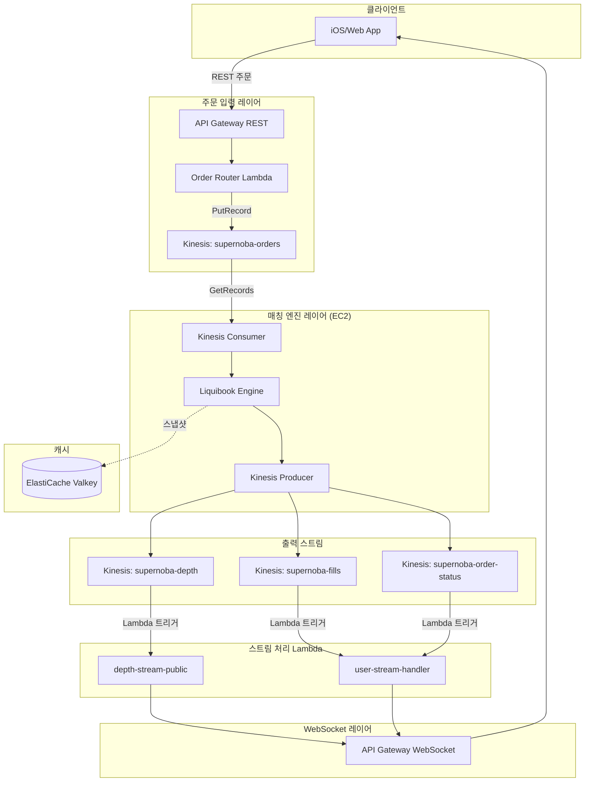

# Kinesis 기반 아키텍처

MSK Lambda 트리거 VPC 연결 이슈 해결을 위해 Amazon Kinesis Data Streams 기반으로 전환합니다.

## 전체 아키텍처



---

## Kinesis 스트림 설계

### 샤드(Shard)란?

**샤드**는 Kinesis 스트림의 기본 처리 단위입니다:

| 항목 | 용량 |
|------|------|
| **쓰기** | 1,000 records/s 또는 1MB/s |
| **읽기** | 2,000 records/s 또는 2MB/s |
| **병렬 처리** | 샤드 수 = 병렬 Lambda 수 |

**파티션 키**로 데이터가 어느 샤드로 갈지 결정됩니다:
```
파티션 키 "AAPL" → Hash → 샤드 1
파티션 키 "TSLA" → Hash → 샤드 2
```

### 스트림 구성

| 스트림 이름 | 샤드 수 | 파티션 키 | 용도 |
|------------|--------|----------|------|
| `supernoba-orders` | 2 | `symbol` | 주문 입력 |
| `supernoba-fills` | 2 | `symbol` | 체결 결과 |
| `supernoba-depth` | 2 | `symbol` | 호가 변경 |
| `supernoba-order-status` | 1 | `user_id` | 주문 상태 |

---

## 클라이언트 확장 시나리오

### 시나리오 1: MVP (1만 동시 사용자)

```
샤드 수: 2개
예상 TPS: 100 주문/초
용량 여유: 20배
월 비용: ~$30
```

### 시나리오 2: 성장기 (5만 동시 사용자)

```
샤드 수: 4개 (On-Demand 자동 확장)
예상 TPS: 500 주문/초
용량 여유: 8배
월 비용: ~$60
```

### 시나리오 3: 대규모 (50만 동시 사용자)

```
샤드 수: 20개
예상 TPS: 5,000 주문/초
용량 여유: 4배
월 비용: ~$300
```

### 자동 확장 설정 (On-Demand 모드)

```bash
aws kinesis update-stream-mode \
  --stream-arn arn:aws:kinesis:ap-northeast-2:xxx:stream/supernoba-orders \
  --stream-mode-details StreamMode=ON_DEMAND
```

---

## 실시간 스트리밍 흐름

### 비로그인 사용자 (depth-stream-public)

```
Kinesis (depth) → Lambda 트리거 → 0.5초 스로틀링 → WebSocket 브로드캐스트
```

### 로그인 사용자 (user-stream-handler)

```
Kinesis (fills) → Lambda 트리거 → 개인 체결 알림 → WebSocket 개별 전송
Kinesis (order_status) → Lambda 트리거 → 주문 상태 → WebSocket 개별 전송
```

---

## C++ 엔진 수정

### 의존성 변경

| 기존 (MSK) | 변경 (Kinesis) |
|-----------|---------------|
| `librdkafka` | AWS SDK C++ |
| `KafkaConsumer` | `KinesisClient::GetRecords` |
| `KafkaProducer` | `KinesisClient::PutRecord` |

### Kinesis Consumer 예시

```cpp
#include <aws/kinesis/KinesisClient.h>
#include <aws/kinesis/model/GetRecordsRequest.h>

void consumeOrders() {
    while (running) {
        GetRecordsRequest request;
        request.SetShardIterator(shardIterator);
        request.SetLimit(100);
        
        auto outcome = client->GetRecords(request);
        for (const auto& record : outcome.GetResult().GetRecords()) {
            std::string data(reinterpret_cast<const char*>(record.GetData().GetUnderlyingData()));
            processOrder(data);
        }
        shardIterator = outcome.GetResult().GetNextShardIterator();
    }
}
```

### Kinesis Producer 예시

```cpp
#include <aws/kinesis/model/PutRecordRequest.h>

void publishFill(const std::string& symbol, const std::string& data) {
    PutRecordRequest request;
    request.SetStreamName("supernoba-fills");
    request.SetPartitionKey(symbol);
    request.SetData(Aws::Utils::ByteBuffer((unsigned char*)data.c_str(), data.length()));
    
    client->PutRecord(request);
}
```

---

## Lambda 수정 가이드

### 환경변수 변경

| 변수 | MSK 값 | Kinesis 값 |
|------|--------|-----------|
| `MSK_BOOTSTRAP_SERVERS` | (삭제) | - |
| `KINESIS_ORDERS_STREAM` | - | `supernoba-orders` |
| `KINESIS_FILLS_STREAM` | - | `supernoba-fills` |
| `KINESIS_DEPTH_STREAM` | - | `supernoba-depth` |

### VPC 설정 변경

```bash
# Kinesis는 VPC 불필요 - VPC 설정 제거
aws lambda update-function-configuration \
  --function-name depth-stream-public \
  --vpc-config SubnetIds=[],SecurityGroupIds=[] \
  --region ap-northeast-2
```

### 트리거 변경 (MSK → Kinesis)

```bash
# 1. 기존 MSK 트리거 삭제
aws lambda delete-event-source-mapping --uuid <msk-esm-uuid>

# 2. Kinesis 트리거 추가
aws lambda create-event-source-mapping \
  --function-name depth-stream-public \
  --event-source-arn arn:aws:kinesis:ap-northeast-2:264520158196:stream/supernoba-depth \
  --starting-position LATEST \
  --batch-size 100 \
  --region ap-northeast-2
```

### Lambda 코드 변경

```javascript
// 기존 MSK 이벤트 파싱
for (const [topic, partitions] of Object.entries(event.records || {})) {
  for (const record of partitions) {
    const value = Buffer.from(record.value, 'base64').toString('utf8');
  }
}

// Kinesis 이벤트 파싱 (변경)
for (const record of event.Records) {
  const value = Buffer.from(record.kinesis.data, 'base64').toString('utf8');
  const data = JSON.parse(value);
}
```

---

## 비용 비교

| 항목 | MSK | Kinesis (On-Demand) |
|------|-----|---------------------|
| 스트리밍 | $100/월 | $30/월 |
| Lambda | $5/월 | $5/월 |
| ElastiCache | $15/월 | $15/월 |
| **총합** | **$120/월** | **$50/월** |

---

## 구현 우선순위

1. **Kinesis 스트림 생성** (1일)
2. **C++ 엔진 Kinesis 연동** (2-3일)
3. **Lambda 수정 및 트리거 변경** (1일)
4. **E2E 테스트 및 MSK 제거** (1일)

---

*최종 업데이트: 2025-12-08*
