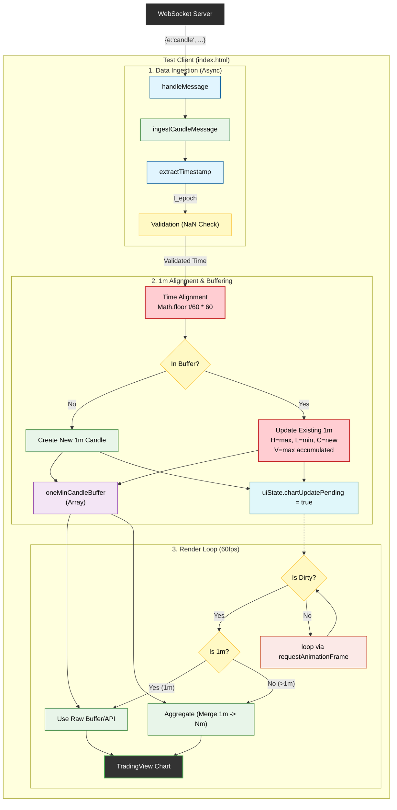

# Client Data Flow Architecture (Test Client)

이 문서는 `liquibook/test/web/index.html` 클라이언트에서 실시간 캔들 데이터가 처리되는 **전체 흐름(End-to-End Data Flow)**을 설명합니다.

## 1. Data Flow Overview

클라이언트는 백엔드 엔진으로부터 **초 단위의 체결 기반 캔들 업데이트**를 수신합니다. 성능 최적화를 위해 **데이터 수신(Ingest)**과 **차트 렌더링(Process)** 로직을 분리하였습니다.

### Core Logic Steps
1.  **Ingest (Immediate)**: WebSocket 이벤트 수신 시 `oneMinCandleBuffer`에 즉시 반영. (Chart Calculation 수행 안 함)
2.  **Align**: `t_epoch`를 1분 단위(`Math.floor(t/60)*60`)로 정렬 (Sawtooth 방지).
3.  **Merge**: 버퍼 내 기존 1분봉이 있으면 OHLCV 갱신(`Math.max` for Volume), 없으면 신규 생성.
4.  **Render Loop (60fps)**: `requestAnimationFrame` 루프에서 `uiState.chartUpdatePending` 플래그 확인.
5.  **Direct/Aggregate**: 1분봉은 버퍼/API 데이터를 **있는 그대로** 사용하고, 상위 타임프레임(5m 등)은 집계하여 그립니다.

---

## 2. Detailed Data Flow Diagram



## 3. Key Implementations

### A. Performance Optimization (Ingest vs Process)
메시지가 초당 수백 개 들어와도 UI가 멈추지 않도록 수신부와 그리기 로직을 분리했습니다.
*   **Ingest**: `ingestCandleMessage()` - 단순 데이터 저장 (매우 빠름)
*   **Process**: `updateTVChartFromBuffer()` - 60fps로 제한된 UI 업데이트

### B. Volume Handling (Cumulative & Simulation)
엔진은 해당 1분 동안의 **누적 거래량**을 전송합니다.
```javascript
existing.volume = Math.max(existing.volume, msg.v); 
```

**Simulation Info**:
*   주문 1건당 주식 수량: `1 ~ 50` (Random)
*   거래량 계산: `Volume = Sum(Quantity)`

### C. Trust-Based Rendering (Updated)
**엔진 데이터의 무결성이 검증되었으므로**, 클라이언트는 **1분봉 데이터에 대해 별도의 후가공(Filtering/Aggregation)을 수행하지 않습니다.**
*   **1m Chart**: DB/API에서 받은 데이터를 그대로 사용 (Pass-through).
*   **>1m Chart**: 1분봉 데이터를 기반으로 클라이언트에서 집계.

## 4. Endpoints & Configuration
| Component | Address / Value | Note |
| :--- | :--- | :--- |
| **WebSocket** | `wss://l2ptm85wub.execute-api.ap-northeast-2.amazonaws.com/production/` | Real-time Stream |
| **Simulation** | Random Quantity (1-50 shares) | Realistic Volume Profile |
| **Engine Integrity** | **Verified (Clean Sine Wave)** | **No Client Filtering Needed** |
